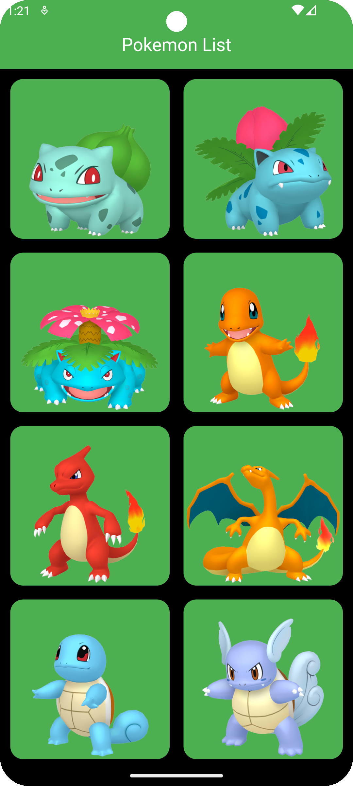
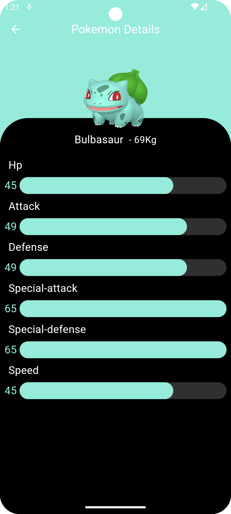
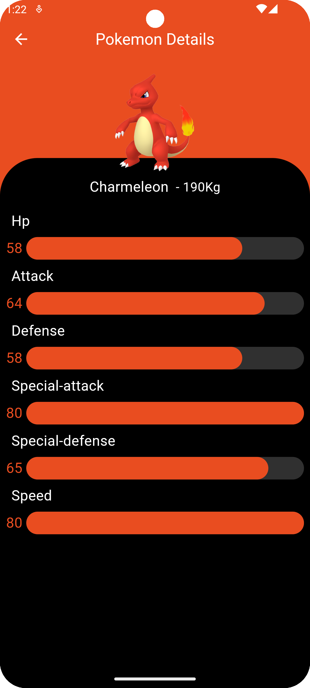

# Pokedex_Flutter

The Pokedex - Pokemon app is a project that applied some Flutter technologies recommended by Flutter
Community such as Bloc Pattern for UI management. Drift SQL Database,
Dio for Network Manager, Get It for Dependencies Injection and Hero Widget for Shared Elements
between the screens.

> [!IMPORTANT]  
> Similar project with (Kotlin Language) :point_right: [Pokedex_Compose](https://github.com/NicosNicolaou16/Pokedex_Compose) :point_left:  

# Examples

  
  
  
  

# The Project Contain the following technologies and libraries

[Dio Network Manager](https://pub.dev/packages/dio) is responsible for making requests and
retrieving data from the remote server.  
[Drift Database](https://drift.simonbinder.eu/docs/getting-started/) is responsible for saving the
retrieved data from the remote server, querying data from the local database, and supporting offline
functionality. ([Drift Database Documentation](https://pub.dev/packages/drift))  
[Bloc Patterns using single state](https://pub.dev/packages/flutter_bloc) along with repositories
and services, separates business logic, data access, and UI by using streams to handle state and
manage data flow. ([Bloc Pattern Documentation](https://bloclibrary.dev/getting-started/))  
[Cached Network Image](https://pub.dev/packages/cached_network_image) is a package that it is
responsible for loading the images and supports offline functionality.   
[Palette](https://pub.dev/packages/palette_generator) is used to retrieve the color from the image;
in our case, we are using the Pokémon color to paint the linear indicator with the same
color.   
[Get It (Dependencies Injection)](https://pub.dev/packages/get_it) is a lightweight dependency
injection package for Flutter that allows you to register and access services globally, promoting
cleaner and more maintainable code.   
[Hero Widget](https://docs.flutter.dev/ui/animations/hero-animations) creates a smooth animation for
shared elements between screens by linking them with a common tag.   
The percentage for showing the skills of each Pokémon is calculated using
the [percentages_with_animation](https://pub.dev/packages/percentages_with_animation) built by
[NicosNicolaou16](https://github.com/NicosNicolaou16).  

# Versioning

Flutter SDK version: 3.27.3  
Dart Version: 3.6.1  

# Feeds/Urls/End Point (parsing some data from the response)

## (Links References for Ends Points)

https://pokeapi.co/  
https://github.com/PokeAPI/sprites (GitHub)  

# References

https://dribbble.com/shots/6540871-Pokedex-App# - Get some UI - not completely use it (CHECK THE
LINK FOR THE DESIGN)  