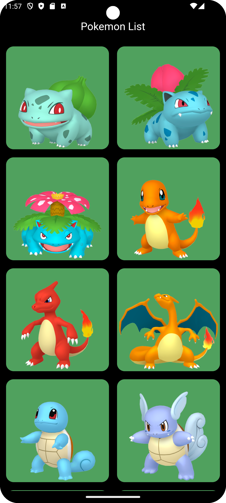
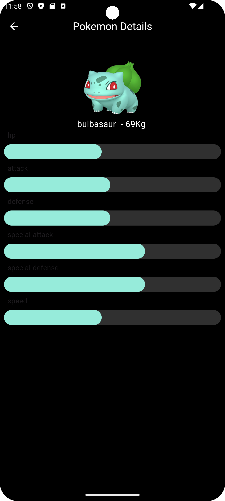

# pokedex_flutter

This Pokedex Flutter project show a list of Pokemons and Details Screen for each Pokemon and stats.

# The Project Contain the following technologies and libraries
Dio Network Manager - https://pub.dev/packages/dio   
Drift Database - https://drift.simonbinder.eu/docs/getting-started/ - https://pub.dev/packages/drift   
Bloc Patterns to handle the states using single   
state - https://bloclibrary.dev/getting-started/ - https://pub.dev/packages/flutter_bloc   
Cached Network Image - https://pub.dev/packages/cached_network_image   
Palette (Using the Pokemon Color to paint the Linear Indicator with the same
color) - https://pub.dev/packages/palette_generator   
Get It (Dependencies Injection) - https://pub.dev/packages/get_it   
Hero Widget - https://docs.flutter.dev/ui/animations/hero-animations   

# Examples

  
  
  

# Versioning

Flutter SDK version: 3.19.6  
Dart Version: 3.3.4  