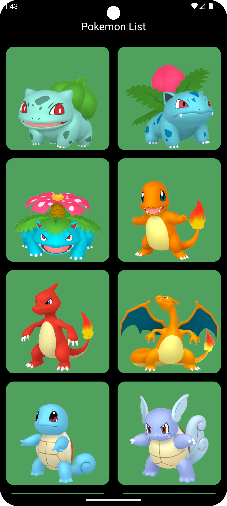
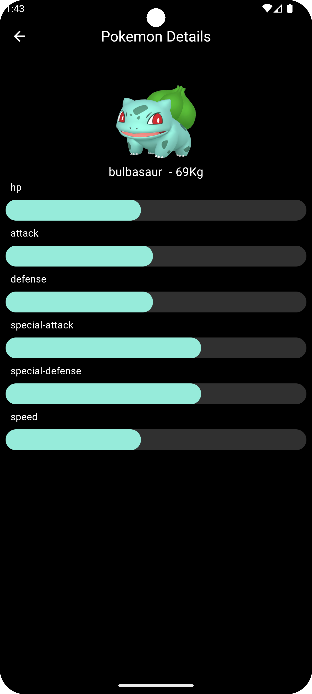
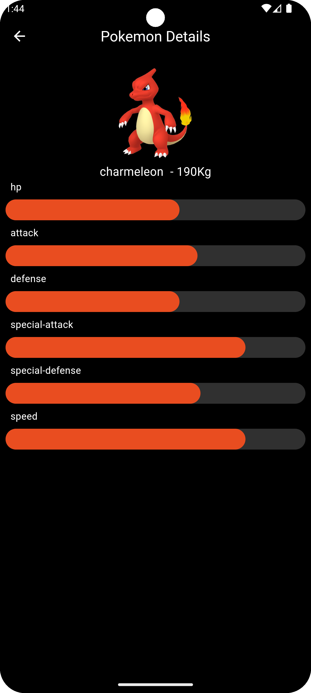

# pokedex_flutter
The Pokedex - Pokemon app is a project that applied some Flutter technologies recommended by Flutter Community such as Bloc Pattern for UI management. Drift SQL Database,
Dio for Network Manager, Get It for Dependencies Injection and Hero Widget for Shared Elements between the screens.

# The Project Contain the following technologies and libraries
Dio Network Manager - https://pub.dev/packages/dio   
Drift Database - https://drift.simonbinder.eu/docs/getting-started/ - https://pub.dev/packages/drift   
Bloc Patterns to handle the states using single state - https://bloclibrary.dev/getting-started/ - https://pub.dev/packages/flutter_bloc   
Cached Network Image - https://pub.dev/packages/cached_network_image   
Palette (Using the Pokemon Color to paint the Linear Indicator with the same color) - https://pub.dev/packages/palette_generator   
Get It (Dependencies Injection) - https://pub.dev/packages/get_it   
Hero Widget - https://docs.flutter.dev/ui/animations/hero-animations   
Offline Support   

# Examples

  
  
  
  

# Versioning
Flutter SDK version: 3.22.0  
Dart Version: 3.4.0  

# Feeds/Urls/End Point (parsing some data from the response)
## (Links References for Ends Points)
https://pokeapi.co/  
https://github.com/PokeAPI/sprites (GitHub)  