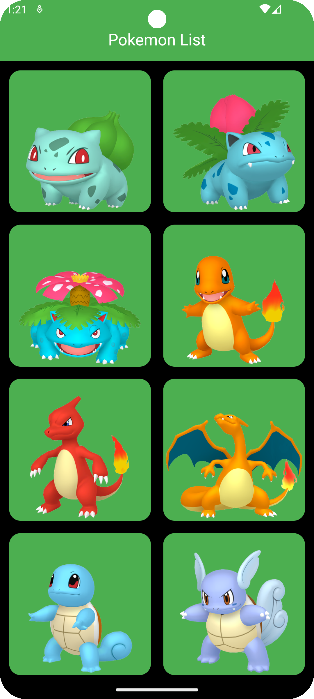
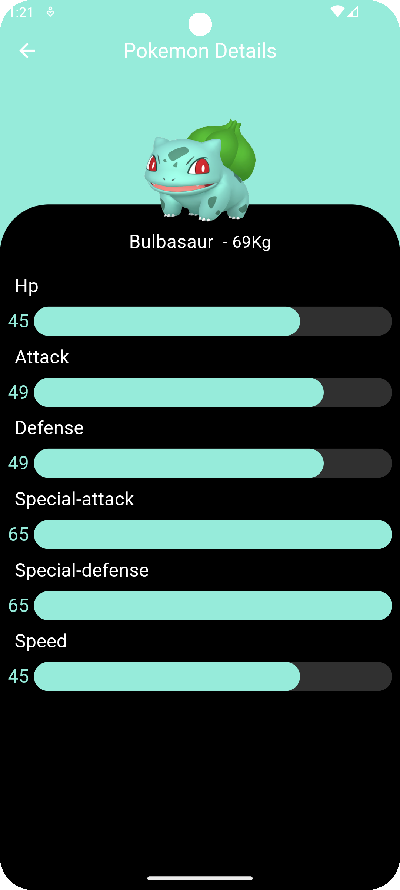
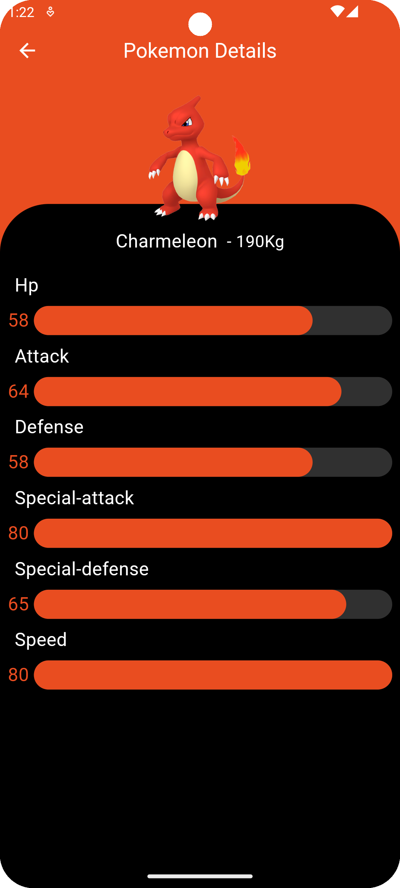

# Pokedex_Flutter

The Pokedex - Pokemon app is a Flutter project that applies technologies recommended by the Flutter Community. It demonstrates a clean architecture and a fluid user interface.

> [!IMPORTANT]
> A similar project is also available in Kotlin for Android!
> 👉 **[Pokedex_Compose](https://github.com/NicosNicolaou16/Pokedex_Compose)** 👈

## ✨ Features

*   **State Management:** Utilizes the **BLoC Pattern** with a single state approach for predictable and maintainable UI logic.
*   **Offline First:** Caches Pokémon data using the **Drift** (Moor) SQL toolkit, allowing the app to be fully functional offline.
*   **Efficient Networking:** Fetches data from the [PokéAPI](https://pokeapi.co/) using the powerful **Dio** HTTP client.
*   **Dependency Injection:** Implements **GetIt** for service locator-based dependency injection, promoting decoupled and testable code.
*   **Smooth Animations:** Leverages the **Hero Widget** for beautiful shared element transitions between screens.
*   **Image Caching:** Uses **CachedNetworkImage** to efficiently load and cache images for offline availability.

## 📸 Screenshots & Demos

  
  
  
  
  

## 🛠️ Tech Stack & Libraries

This project is built with **[Dart](https://dart.dev/)** and the **[Flutter](https://flutter.dev/)** framework, utilizing a variety of modern libraries:

*   **Networking:** [Dio](https://pub.dev/packages/dio)
*   **Database & Offline Storage:** [Drift](https://pub.dev/packages/drift)
*   **State Management:** [flutter_bloc](https://pub.dev/packages/flutter_bloc)
*   **Image Handling:** [cached_network_image](https://pub.dev/packages/cached_network_image)
*   **Dependency Injection:** [get_it](https://pub.dev/packages/get_it)
*   **UI & Animations:** [Hero Widget](https://docs.flutter.dev/ui/animations/hero-animations)
*   **Custom Components:** [percentages_with_animation](https://pub.dev/packages/percentages_with_animation) for displaying Pokémon stats, built by [@NicosNicolaou16](https://github.com/NicosNicolaou16).

## 🔧 Versioning

*   **Flutter SDK Version:** 3.31.2
*   **Dart Version:** 3.11.0

## 📚 APIs & References

### Data Sources

*   **Primary API:** [PokéAPI (pokeapi.co)](https://pokeapi.co/)
*   **Image Sprites:** [PokeAPI/sprites on GitHub](https://github.com/PokeAPI/sprites)

### Design & Inspiration

*   **UI/UX Design Inspiration:** [Dribbble - Pokedex App by Alexandr](https://dribbble.com/shots/6540871-Pokedex-App) (Note: Used as inspiration, not a direct copy).
*   **App Icon:** Derived from [Fandom Ideas Wiki](https://ideas.fandom.com/wiki/Pok%C3%A9_Ball_Pok%C3%A9mon_Ideas_(Super_Smash_Bros._series)?file=Pok%C3%A9_Ball_Redraw_by_oykawoo.png).

## ⭐ Stargazers

If you enjoy this project, please give it a star!
Check out all the stargazers
here: [Stargazers on GitHub](https://github.com/NicosNicolaou16/Pokedex_Flutter/stargazers)

## 🙏 Support & Contributions

This library is actively maintained. Feedback, bug reports, and feature requests are welcome! Please feel free to **open an issue** or submit a **pull request**.